## 博客网站

&emsp;&emsp;该项目是基于vue全家桶（vue、vue-router、vuex、vue SSR）开发的一套博客前台页面，主要功能包括首页显示、认证系统、文章管理、评论管理和点赞管理

### 访问地址

&emsp;&emsp;域名：[https://xiaohuochai.cc](https://xiaohuochai.cc)

&emsp;&emsp;Github: [https://github.com/littlematch0123/blog-client](https://github.com/littlematch0123/blog-client)

&emsp;&emsp;或者可以直接扫描二维码访问


### 项目介绍

&emsp;&emsp;该项目的内容以笔者自学前端的过程中写的600多篇博客为基础，对于同样学习前端的同学可能会有所帮助。许多博客都有直接可以操作的DEMO，对知识的理解可能会更直观

&emsp;&emsp;采用移动优先的响应式布局，移动端、桌面端均可适配；字体大小使用em单位，桌面端的文字相应变大；移动端可使用滑屏操作，桌面端通过光标设置、自定义滚动条、回车确定等，提升交互体验

&emsp;&emsp;全站采用服务器端渲染SSR的方式，有利于SEO，减少了首屏渲染时间；使用service worker和manifest实现了PWA方案的离线缓存和添加到桌面的功能

&emsp;&emsp;根据HTML标签内容模型，使用语义化标签，尽量减少标签层级，尽量减少无语义的div标签

&emsp;&emsp;CSS大量使用类选择器，尽量减少选择器层级，在vue组件中使用CSS module和postCSS，使用styleLint规范CSS代码，按照布局类属性、盒模型属性、文本类属性、修饰类属性的顺序编写代码，并使用order插件进行校验

&emsp;&emsp;使用esLint规范JS代码，代码风格参照airbnb规范，所有命名采用驼峰写法，公共组件以Base为前缀，事件函数以on为前缀，异步函数以async为后缀，布尔值基本以do或is为前缀

&emsp;&emsp;没有引用第三方组件库，如bootstrap或element组件，而是自己开发了项目中所需的公共组件。在common目录下，封装了头像、全屏、loading、遮罩、搜索框、联动选择等组件，方便开发

&emsp;&emsp;使用配置数据，实现了数据和应用分离，以常量的形式存储在constants目录下

&emsp;&emsp;使用了阿里云的短信模块，实现了短信验证功能

&emsp;&emsp;该项目有两个隐藏彩蛋，一个是摇一摇功能，可以直接摇到后台页面，另一个是陀螺仪功能，上下晃动手机时，头像会进行旋转

&emsp;&emsp;项目进行了代码优化，最终优化评分如下所示

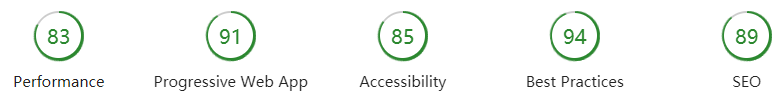


### 功能演示

&emsp;&emsp;主要功能包括首页显示、认证系统、文章管理、评论管理和点赞管理

【首页显示】

&emsp;&emsp;首页包括可拖拽轮播图、专题推荐、文章推荐和类别推荐

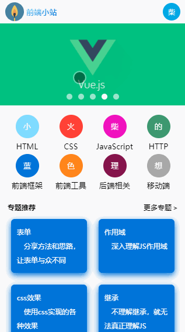

【认证系统】

&emsp;&emsp;认证系统包括用户注册、用户登录、短信验证

&emsp;&emsp;1、用户处于未登录态时，可以阅读文章，但不能点赞和评论，否则会弹出登录框

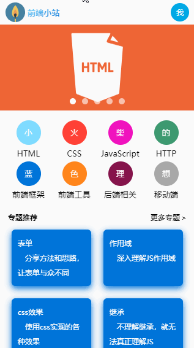

&emsp;&emsp;2、用户注册

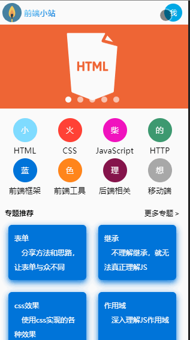

&emsp;&emsp;3、用户登录

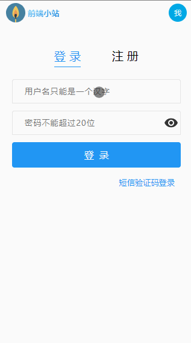

【文章管理】

&emsp;&emsp;文章管理包括浏览推荐文章、按类别筛选、文章搜索、按目录查看

&emsp;&emsp;1、浏览推荐文章

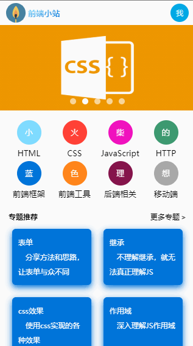

&emsp;&emsp;2、文章筛选

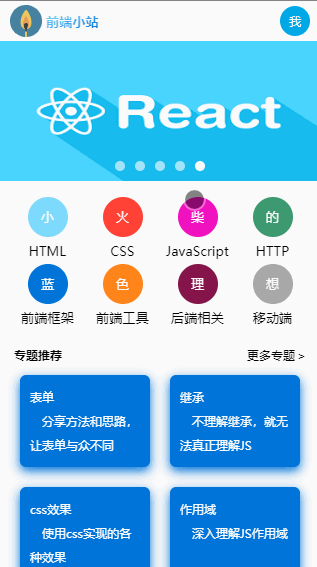

&emsp;&emsp;3、文章搜索

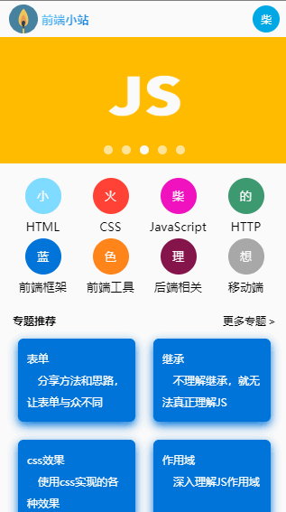

&emsp;&emsp;4、按目录查看

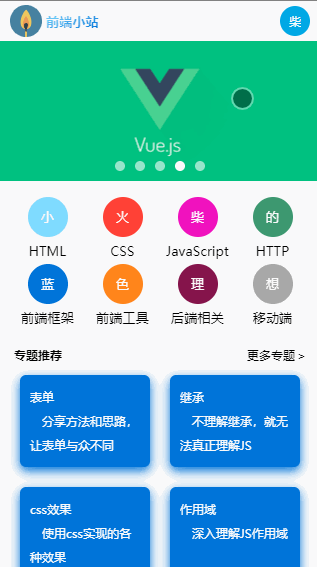

【点赞管理】

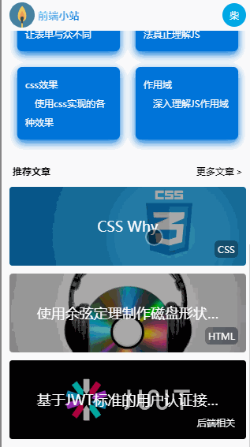

【评论管理】

&emsp;&emsp;评论管理包括查看评论、添加评论、修改评论和删除评论

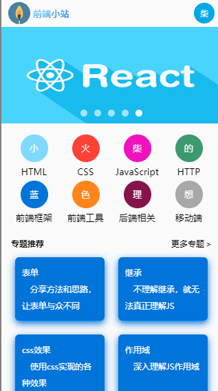


### 目录结构

&emsp;&emsp;src目录下，包括assets(静态资源)、common(公共组件)、components(功能组件)、constants(常量配置)、router(路由)、store(vuex)和utils(工具方法)这7个目录

```
- assets // 存放静态资源，主要是图片
    -imgs
    　　css.png // CSS文章背景图
　　　　 ...
- common // 存放公共组件
    -SVG // 存放VUE图标组件
        SVGAdd.vue // "添加到"按钮
        SVGBack.vue // "返回"按钮
        ...
    BaseArticle.vue // 文章组件
    BaseAvatar.vue // 头像组件
    ...
- components // 存放功能组件
    -Post // 文章组件
      module.js //文章状态管理
      Post.vue // 文章显示组件
      PostContent.vue // 文章目录组件
      PostList.vue // 文章列表组件
      SearchPost.vue // 搜索文章组件
      ...
- constants // 存放常量配置
    API.js // 存放API调用地址
- router // 存放路由
    index.js
- store // 存放vuex
    index.js
- utils // 存放工具方法
    async.js // axios方法
    fnVarificate.js // 表单验证方法
    util.js // 其他工具方法
```

【公共组件】

&emsp;&emsp;没有引用第三方组件库，如bootstrap或element组件，而是自己开发了项目中所需的公共组件

&emsp;&emsp;封装了文章组件、头像组件、返回组件、按钮组件、卡片组件、全屏组件、输入框组件、loading组件、遮罩组件、搜索框组件、多行输入框组件、标题组件、面包屑组件、按钮组组件、反色按钮组件、密码框组件、包含检测的输入框组件和联动选择组件

```
BaseAdd.vue // "添加到"组件
BaseArticle.vue  // 文章组件
BaseAvatar.vue // 头像组件
BaseBack.vue // 返回组件
BaseButton.vue // 按钮组件
BaseCard.vue // 卡片组件
BaseFullScreen.vue // 全屏组件
BaseInput.vue  // 输入框组件
BaseLoading.vue  // loading组件
BaseMask.vue // 遮罩组件
BaseSearchBox.vue  // 搜索框组件
BaseTextArea.vue // 多行输入框组件
BaseTitle.vue  // 标题组件
BreadCrumb.vue // 面包屑组件
ButtonBox.vue  // 按钮组组件
ButtonInverted.vue // 反色按钮组件
InputPassword.vue  // 密码框组件
InputWithTest.vue // 包含检测的输入框组件
LinkageSelector.vue // 联动选择组件
```

【功能组件】

&emsp;&emsp;按照功能来设置目录，如下所示

```
弹出框(Alert)
类别管理(Category)
评论管理(Comment)
主页(Home)
点赞管理(Like)
文章管理(Post)
页面尺寸(Size)
公共头部(TheHeader)
用户管理(User)
```

### 整体思路

【全屏布局】

&emsp;&emsp;使用设置高度的全屏布局方式，主要通过calc来实现

```
<div
  id="root"
  :class="$style.wrap"
  :style="{height:wrapHeight+'px'}"
>
  ...
  <TheHeader :class="$style.header"/>
  <main :class="$style.main">
    <transition :name="transitionName">
      <router-view :class="$style.router" />
    </transition>
  </main>
</div>
```
```
.header {
  height: 40px;
}
.main {
  position: relative;
  height: calc(100% - 40px);
  overflow: auto;
}
```

【层级管理】

&emsp;&emsp;项目的层级z-index，只使用0-3

&emsp;&emsp;全屏的弹出框优化级最高，设置为3；侧边栏设置为2；页面元素默认为0，如有需要，要设置为1

【全局弹出层】

&emsp;&emsp;在入口文件App.vue中设置全局的弹出层和loading，所有组件都可以共用

```
// App.vue
<template>
  <div
    id="root"
    :class="$style.wrap"
    :style="{height:wrapHeight+'px'}"
  >
    <AlertWithLoading v-show="doShowLoading" />
    <AlertWithText
      v-show="alertText !== ''"
      :text="alertText"
      :onClick="() => {$store.commit(HIDE_ALERTTEXT)}"
    />
    <TheHeader :class="$style.header"/>
    <main :class="$style.main">
      <transition :name="transitionName">
        <router-view :class="$style.router" />
      </transition>
    </main>
  </div>
</template>
```

【路由管理】

&emsp;&emsp;vue-router使用静态路由表的形式对路由进行管理，虽然没有react-router-dom灵活，但方便寻找，一目了然

&emsp;&emsp;按路由设置按需加载组件，并设置滚动行为

```
import Vue from 'vue'
import Router from 'vue-router'

Vue.use(Router)
export default function createRouter() {
  return new Router({
    mode: 'history',
    routes: [
      {
        path: '/',
        component: () => import(/* webpackChunkName:'home' */ '@/components/Home/Home'),
        name: 'home',
        meta: { index: 0 }
      },
      {
        path: '/posts',
        component: () => import(/* webpackChunkName:'post' */ '@/components/Post/PostList'),
        name: 'postlist'
      },
      {
        path: '/posts/search',
        component: () => import(/* webpackChunkName:'post' */ '@/components/Post/SearchPost'),
        name: 'searchpost'
      },
      {
        path: '/posts/:postid',
        component: () => import(/* webpackChunkName:'post' */ '@/components/Post/Post'),
        name: 'post',
        children: [
          {
            path: 'comments',
            name: 'commentlist',
            component: () => import(/* webpackChunkName:'comment' */ '@/components/Comment/CommentList'),
            children: [
              {
                path: 'add',
                name: 'addcomment',
                component: () => import(/* webpackChunkName:'comment' */ '@/components/Comment/AddComment')
              },
              {
                path: ':commentid/update',
                name: 'updatecomment',
                component: () => import(/* webpackChunkName:'comment' */ '@/components/Comment/UpdateComment')
              },
              {
                path: ':commentid/delete',
                name: 'deletecomment',
                component: () => import(/* webpackChunkName:'comment' */ '@/components/Comment/DeleteComment')
              }
            ]
          }
        ]
      },
      {
        path: '/categories',
        component: () => import(/* webpackChunkName:'category' */ '@/components/Category/CategoryList'),
        name: 'categorylist'
      },
      {
        path: '/categories/:number',
        component: () => import(/* webpackChunkName:'category' */ '@/components/Category/Category'),
        name: 'category'
      },
      {
        path: '/topics/:number',
        component: () => import(/* webpackChunkName:'category' */ '@/components/Category/CategoryTopic'),
        name: 'topic'
      },
      // 注册
      {
        path: '/signup',
        component: () => import(/* webpackChunkName:'user' */ '@/components/User/AuthSignup'),
        name: 'signup'
      },
      // 按手机号登录
      {
        path: '/signin_by_phonenumber',
        component: () => import(/* webpackChunkName:'user' */ '@/components/User/AuthSigninByPhoneNumber'),
        name: 'signin_by_phonenumber'
      },
      // 按用户名登录
      {
        path: '/signin_by_username',
        component: () => import(/* webpackChunkName:'user' */ '@/components/User/AuthSigninByUsername'),
        name: 'signin_by_username'
      },
      // 用户页面
      {
        path: '/users/:userid',
        component: () => import(/* webpackChunkName:'user' */ '@/components/User/UserDesk'),
        name: 'user'
      }
    ],
    scrollBehavior(to, from, savedPosition) {
      if (savedPosition) {
        return savedPosition
      }
      return { x: 0, y: 0 }
    }
  })
}
```
【状态管理】

&emsp;&emsp;每个组件的状态管理命名为module.js，保存在当前组件目录下

```
import Vue from 'vue'
import Vuex from 'vuex'
import auth from '@/components/User/module'
import alert from '@/components/Alert/module'
import post from '@/components/Post/module'
import category from '@/components/Category/module'
import like from '@/components/Like/module'
import size from '@/components/Size/module'
import comment from '@/components/Comment/module'

Vue.use(Vuex)
export default function createStore() {
  return new Vuex.Store({
    modules: {
      auth,
      alert,
      post,
      category,
      like,
      size,
      comment
    }
  })
}
```

&emsp;&emsp;每个组件的状态包括state、getters、actions和mutations字段，以Category组件为例

```
import { BASE_CATEGORY_URL } from '@/constants/API'
import { getNumberWithoutPostPositiveZero, getCategoryNumbers } from '@/utils/util'

export const LOAD_CATEGORIES = 'LOAD_CATEGORIES'
export const LOAD_CATEGORIES_ASYNC = 'LOAD_CATEGORIES_ASYNC'
const category = {
  state: {
    docs: []
  },
  getters: {
    categoryCount: state => state.docs.length,
    getCategoriesByNumber: state => state.docs.reduce((obj, t) => {
      obj[t.number] = t
      return obj
    }, {}),
    getCategoryByNumber: state => number => state.docs.find(doc => doc.number === number),
    getPosterityCategories: (state, getters) => number => {
      const reg = new RegExp(`^${getNumberWithoutPostPositiveZero(number)}`)
      return state.docs.filter(doc => {
        doc.titleDatas = getCategoryNumbers(doc.number).map(t => getters.getCategoriesByNumber[t].name)
        return String(doc.number).match(reg) && (doc.posts.length)
      })
    },
    getChildrenCategoryies: state => number => {
      const reference = String(getNumberWithoutPostPositiveZero(number))
      const len = reference.length
      const regExp = new RegExp(`^${reference}(0[1-9]|[1-9][0-9])(0){${8 - len}}`)
      return state.docs.filter(doc => String(doc.number).match(regExp))
    },
    getCategoryRootDatas: state => state.docs.filter(doc => Number(String(doc.number).slice(2)) === 0),
    getRecommendedCategories: state => state.docs.filter(t => t.recommend).sort((a, b) => a.index - b.index)
  },
  actions: {
    /* 获取全部类别信息 */
    [LOAD_CATEGORIES_ASYNC]({ commit }) {
      return new Promise((resolve, reject) => {
        this._vm.$axios({
          commit,
          url: BASE_CATEGORY_URL,
          doHideAlert: true,
          success(result) {
            // 保存类别
            commit(LOAD_CATEGORIES, result.docs)
            // 向前端通知操作成功
            resolve(result.docs)
          },
          fail(err) {
            // 向前端通知操作失败
            reject(err)
          }
        })
      })
    }
  },
  mutations: {
    /* 保存类别信息 */
    [LOAD_CATEGORIES](state, payload) {
      state.docs = payload
    }
  }
}
export default category
```

【数据传递】

&emsp;&emsp;组件间的数据传递方式一般有三种，一种是使用vue中的props和自定义事件，另一种是使用路由的params属性，还有一种是通过vuex

&emsp;&emsp;1、props和自定义事件

```
// BaseInput
<template>
  <input
    :class="$style.input"
    :value="value"
    autocomplete="off"
    autocapitalize="off"
    @input="$emit('input', $event.target.value)"
  >
</template>
<script>
export default {
  props: {
    value: { type: String, default: '' }
  }
}
</script>

// InputPassword
<input
  :class="$style.input"
  :placeholder="placeholder"
  :value="value"
  autocomplete="off"
  autocapitalize="off"
  type="password"
  @input="$emit('input',$event.target.value)"
>
```

&emsp;&emsp;2、路由的params属性

```
// Post.vue
 <BaseBack @click.native="$router.push($route.params.parentPath || '/')">返回</BaseBack>

//AuthSign.vue
<template>
    <router-link
        :active-class="$style.active"
        :to="{ name: 'signin', params: { parentPath } }"
    >登&nbsp;录</router-link>
</template>
<script>
export default {
  computed: {
    parentPath() {
      const temp = this.$route.params.parentPath
      if (temp) {
        return temp
      }
      return ''
    }
  }
}
</script>
```

&emsp;&emsp;3、使用vuex

```
// Category.vue
<template>
  <article v-if="category" :class="$style.box">
    <BaseBack @click.native="$router.push('/categories')">类别列表</BaseBack>
    <BaseTitle>{{ category.name }}知识体系</BaseTitle>
    ...
  </article>
</template>
<script>
export default {
  computed: {
    category() {
      return this.$store.getters.getCategoryByNumber(Number(this.paramsNumber))
    }
    ...
  }
}
</script>
```

### 项目优化

【离线缓存】

&emsp;&emsp;通过service worker实现离线缓存效果

```
const SWPrecacheWebpackPlugin = require('sw-precache-webpack-plugin')

plugins: [
  new SWPrecacheWebpackPlugin({
    dontCacheBustUrlsMatching: /\.\w{8}\./,
    filename: 'service-worker.js',
    logger(message) {
      if (message.indexOf('Total precache size is') === 0) {
        return;
      }
      if (message.indexOf('Skipping static resource') === 0) {
        return;
      }
      console.log(message);
    },
    navigateFallback: 'https://www.xiaohuochai.cc',
    minify: true,
    navigateFallbackWhitelist: [/^(?!\/__).*/],
    dontCacheBustUrlsMatching: /./,
    staticFileGlobsIgnorePatterns: [/\.map$/, /\.json$/],
    runtimeCaching: [{
        urlPattern: '/',
        handler: 'networkFirst'
      },
      {
        urlPattern: /\/(posts|categories|users|likes|comments)/,
        handler: 'networkFirst'
      }
    ]
  })
]
```

【添加到桌面】

&emsp;&emsp;andriod下，通过设置manifest.json文件添加到桌面，而IOS则需要设置meta标签

```
<meta name="theme-color" content="#fff"/>
<meta name="apple-mobile-web-app-capable" content="yes">
<meta name="apple-mobile-web-app-status-bar-style" content="black">
<meta name="apple-mobile-web-app-title" content="前端小站">
<link rel="apple-touch-icon" href="/logo/logo_256.png">
<link rel="shortcut icon" href="/logo/favicon.ico">
<link rel="manifest" href="/manifest.json" />

// manifest.json
{
  "name": "小火柴的前端小站",
  "short_name": "前端小站",
  "start_url": "/",
  "display": "standalone",
  "description": "",
  "theme_color": "#fff",
  "background_color": "#d8d8d8",
  "icons": [{
      "src": "./logo/logo_32.png",
      "sizes": "32x32",
      "type": "image/png"
    },
    {
      "src": "./logo/logo_48.png",
      "sizes": "48x48",
      "type": "image/png"
    },
    {
      "src": "./logo/logo_96.png",
      "sizes": "96x96",
      "type": "image/png"
    },
    {
      "src": "./logo/logo_144.png",
      "sizes": "144x144",
      "type": "image/png"
    },
    {
      "src": "./logo/logo_192.png",
      "sizes": "192x192",
      "type": "image/png"
    },
    {
      "src": "./logo/logo_256.png",
      "sizes": "256x256",
      "type": "image/png"
    }
  ]
}
```

【子页面刷新】

&emsp;&emsp;子页面刷新时，可能会出现得不到从父级传递过来的数据的情况，笔者的处理是跳转到父级页面

```
mounted() {
  if (!this.comment && this.operate === 'update') {
    this.$router.push(`/posts/${this.postId}/comments`)
  } else {
    this.setTextAreaValue()
  }
}
```
【promise】

&emsp;&emsp;为actions添加Promise，方便状态改变后的处理

```
[LOAD_COMMENTS_ASYNC]({ commit }, payload) {
  return new Promise((resolve, reject) => {
    this._vm.$axios({
      commit,
      data: payload,
      url: BASE_COMMENT_URL,
      doHideAlert: true,
      success(result) {
        // 保存类别
        commit(LOAD_COMMENTS, result.docs)
        // 向前端通知操作成功
        resolve(result.docs)
      },
      fail(err) {
        // 向前端通知操作失败
        reject(err)
      }
    })
  })
}
```

【组件共用】

&emsp;&emsp;由于编辑和新建组件用到的元素是一样的，只不过，新建组件时内容为空，编辑组件时需要添加内容，这时就可以复用组件

```
// AddComment.vue
<CommentForm operate="add" />

//UpdateComment.vue
<CommentForm operate="update" />
```

【清理环境】

&emsp;&emsp;如果使用addEventListener绑定了事件处理函数，在组件销毁的时候，要及时清理环境

```
mounted() {
  window.addEventListener('devicemotion', throttle(this.testShake))
}
beforeDestroy() {
  window.removeEventListener('devicemotion', throttle(this.testShake))
}
```

【应用和数据分离】

&emsp;&emsp;使用配置数据，实现数据和应用分离，配置数据主要是API调用地址，以常量的形式存储在constants目录下

```
// API.js
let API_HOSTNAME
if (process.env.NODE_ENV === 'production') {
  API_HOSTNAME = 'https://api.xiaohuochai.cc'
} else {
  API_HOSTNAME = '/api'
}
export const SIGNUP_URL = `${API_HOSTNAME}/auth/signup`
export const SIGNIN_BYUSERNAME_URL = `${API_HOSTNAME}/auth/signin_by_username`
export const SIGNIN_BYPHONENUMBER_URL = `${API_HOSTNAME}/auth/signin_by_phonenumber`
export const VERIFICATE_URL = `${API_HOSTNAME}/auth/verificate`

export const BASE_USER_URL = `${API_HOSTNAME}/users`
export const BASE_POST_URL = `${API_HOSTNAME}/posts`
export const BASE_TOPIC_URL = `${API_HOSTNAME}/topics`
export const BASE_CATEGORY_URL = `${API_HOSTNAME}/categories`
export const BASE_LIKE_URL = `${API_HOSTNAME}/likes`
export const BASE_COMMENT_URL = `${API_HOSTNAME}/comments`

export const ADMIN_URL = 'https://admin.xiaohuochai.cc'
```

【函数节流】

&emsp;&emsp;为触发频率较高的函数使用函数节流

```
/**
 * 函数节流
 * @param {fn} function test(){}
 * @return {fn} function test(){}
 */
export const throttle = (fn, wait = 100) => function func(...args) {
  if (fn.timer) return
  fn.timer = setTimeout(() => {
    fn.apply(this, args)
    fn.timer = null
  }, wait)
}
```

【DNS预解析】

&emsp;&emsp;DNS预解析通过设置meta标签实现

```
<link rel="dns-prefetch" href="//api.xiaohuochai.cc" />
<link rel="dns-prefetch" href="//static.xiaohuochai.site" />
<link rel="dns-prefetch" href="//demo.xiaohuochai.site" />
<link rel="dns-prefetch" href="//pic.xiaohuochai.site" />
```

【图片懒加载和webp】

&emsp;&emsp;通过vue-lazyload插件实现图片懒加载和andriod系统下图片转换成webp格式

```
Vue.use(VueLazyload, {
  loading: require('./assets/imgs/loading.gif'),
  listenEvents: ['scroll'],
  filter: {
    webp(listener, options) {
      if (!options.supportWebp) return
      const isCDN = /xiaohuochai.site/
      if (isCDN.test(listener.src)) {
        listener.src += '?imageView2/2/format/webp'
      }
    }
  }
})
```

### 功能实现

【摇一摇效果】

&emsp;&emsp;摇一摇效果主要通过监测devicemotion事件实现

```
  mounted() {
    window.addEventListener('devicemotion', throttle(this.testShake))
  },
  beforeDestroy() {
    window.removeEventListener('devicemotion', throttle(this.testShake))
  },
  methods: {
    testShake(e) {
      const { x, y, z } = e.accelerationIncludingGravity
      const { lastX, lastY, lastZ } = this
      const nowRange = Math.abs(lastX - x) + Math.abs(lastY - y) + Math.abs(lastZ - z)
      if (nowRange > 80) {
        window.location.href = ADMIN_URL
      }
      this.lastX = x
      this.lastY = y
      this.lastZ = z
    }
  }
```
【陀螺仪效果】

&emsp;&emsp;陀螺仪效果主要通过监测deviceorientation事件实现

```
  mounted() {
    // 监测陀螺仪
    window.addEventListener('deviceorientation', throttle(this.changeBeta))
  },
  beforeDestroy() {
    // 取消监测
    window.removeEventListener('deviceorientation', throttle(this.changeBeta))
  },
  methods: {
    changeBeta(e) {
      if (this.beta !== Math.round(e.beta)) {
        this.beta = Math.round(e.beta)
      }
    }
  }
```
【缓动弹出层】

&emsp;&emsp;过渡弹出层有两种实现方式，包括transition和animation，该项目使用animation的方式实现

```
<UserMenuList v-if="doShowMenuList" :onExit="() => {doShowMenuList = false}"/>
```
```
@keyframes move {
  100% { transform: translateY(0); }
}
@keyframes opacity {
  100% { opacity: 1; }
}
.mask {
  opacity: 0;
  animation: opacity linear both .2s;
}
.list {
  transform: translateY(-100%);
  animation: move forwards .2s;
}
```

【图标管理】

&emsp;&emsp;所有的图标都使用SVG格式，存储在common/SVG目录下

```
// SVGAdd.vue
<template>
  <svg fill="#000000" height="24" viewBox="0 0 24 24" width="24" xmlns="http://www.w3.org/2000/svg">
    <path d="M19 3H5c-1.11 0-2 .9-2 2v14c0 1.1.89 2 2 2h14c1.1 0 2-.9 2-2V5c0-1.1-.9-2-2-2zm-2 10h-4v4h-2v-4H7v-2h4V7h2v4h4v2z"/>
    <path d="M0 0h24v24H0z" fill="none"/>
  </svg>
</template>
```

【axios函数封装】

&emsp;&emsp;封装axios函数到utils目录下的async.js文件中，将loading组件、alert组件整合到axios函数的整个数据获取过程中

```
import { SHOW_LOADING, HIDE_LOADING, SHOW_ALERTTEXT, HIDE_ALERTTEXT } from '@/components/Alert/module'
import { SIGNOUT } from '@/components/User/module'
import axios from 'axios'

const async = {
  install(Vue) {
    Vue.prototype.$axios = ({ commit, url, method, data, headers, success, fail, doHideAlert }) => {
      // 显示loading
      commit(SHOW_LOADING)
      let axiosObj = url
      if (method) {
        axiosObj = { method, url, data, headers }
      }
      axios(axiosObj)
        .then(res => {
          const { message, result } = res.data
          // 关闭loading
          commit(HIDE_LOADING)
          // 显示成功提示
          !doHideAlert && commit(SHOW_ALERTTEXT, message)
          // 1秒后自动关闭提示
          setTimeout(() => { commit(HIDE_ALERTTEXT) }, 1000)
          // 成功后的回调函数
          success && success(result)
        })
        .catch(err => {
          // 关闭loading
          commit(HIDE_LOADING)
          if (err.response) {
            const { data } = err.response
            // 自定义错误
            if (data.code === 1) {
              commit(SHOW_ALERTTEXT, data.message)
              // 系统错误
            } else if (data.code === 2) {
              commit(SHOW_ALERTTEXT, data.message)
              fail && fail(err)
              // 认证错误
            } else if (data.code === 3) {
              commit(SHOW_ALERTTEXT, data.message)
              commit(SIGNOUT)
              window.location.href = '/signin_by_username'
            } else {
              // 显示错误提示
              commit(SHOW_ALERTTEXT, '服务器故障')
              // 失败后的回调函数
              fail && fail(err)
            }
          } else {
            // 显示错误提示
            commit(SHOW_ALERTTEXT, '服务器故障')
            // 失败后的回调函数
            fail && fail(err)
          }
        })
    }
  }
}

export default async
```

【目录跳转】

&emsp;&emsp;使用scrollIntoView()方法，点击目录时，文章跳转到相关部分，且不改变URL

```
<ul :class="$style.list">
  <li
    v-for="(item, index) in titles"
    :key="item"
    :class="$style.item"
    @click="onChangeAnchor(`anchor${index+1}`)"
  >
    {{ index + 1 }}、{{ item }}
  </li>
</ul>
```
```
methods: {
  onChangeAnchor(id) {
    document.getElementById(id).scrollIntoView({ behavior: 'smooth' })
  }
}
```

### 兼容处理

【锚点】

&emsp;&emsp;使用锚点进行页面内跳转时，URL发生改变，页面刷新，其他浏览器没有问题。但是，ISO下的PWA桌面图标会跳转到safari浏览器中

&emsp;&emsp;使用scrollIntoView()方法来替代锚点#，页面内只跳转不刷新。andriod下支持给scrollIntoView设置平滑滚动behavior: 'smooth'，但IOS不支持

【页面放大】

&emsp;&emsp;IOS下，input获取焦点时会放大，meta设置user-scalable=no，可取消放大效果

```
<meta name="viewport" content="width=device-width, initial-scale=1, user-scalable=no, shrink-to-fit=no">
```
【圆角】

&emsp;&emsp;IOS下，input域只显示底边框时，会出现底边圆角效果，设置border-radius:0即可
```
border-radius:0
```
【轮廓outline】

&emsp;&emsp;android浏览器下，input域处于焦点状态时，默认会有一圈淡黄色的轮廓outline效果

&emsp;&emsp;通过设置outline:none可将其去除
```
outline: none
```
【点击背景】

&emsp;&emsp;在移动端，点击可点击元素时，android下会出现淡蓝色背景，IOS下会出现灰色背景

&emsp;&emsp;可以通过-webkt-tap-hightlight-color属性的设置，取消点击时出现的背景效果
```
* {
  -webkit-tap-highlight-color: rgba(0, 0, 0, 0);
}
```
【局部不滚动】

&emsp;&emsp;IOS下，可能会出现局部滚动不流畅，甚至局部不滚动的bug

&emsp;&emsp;通过在该元素上设置overflow-scrolling属性为touch即可解决
```
div {
  -webkit-overflow-scrolling: touch;
}
```
【锚点】

&emsp;&emsp;使用锚点进行页面内跳转时，URL发生改变，页面刷新，其他浏览器没有问题。但是，ISO下的PWA桌面图标会跳转到safari浏览器中

&emsp;&emsp;使用scrollIntoView()方法来替代锚点#，页面内只跳转不刷新。andriod下支持给scrollIntoView设置平滑滚动behavior: 'smooth'，但IOS不支持

